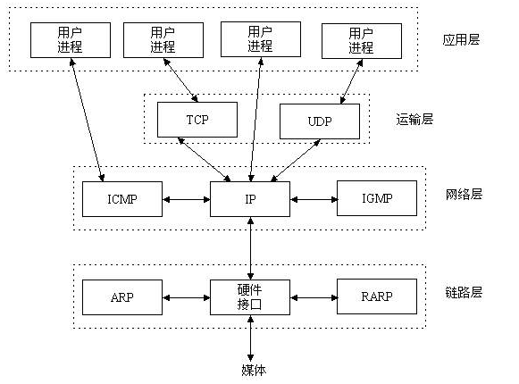
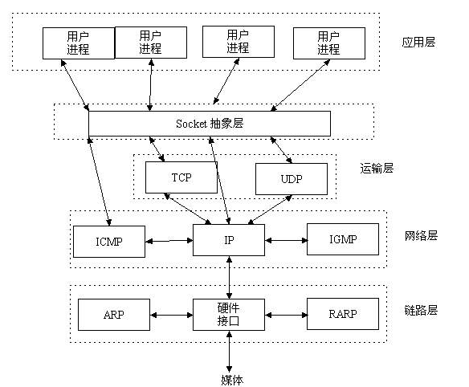
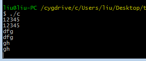
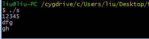

# Linux C Socket
部分转自：http://goodcandle.cnblogs.com/archive/2005/12/10/294652.aspx

1. 什么是TCP/IP、UDP？

2. Socket在哪里呢？

3. Socket是什么呢？

4. 有很多的框架，为什么还在从Socket开始？

5. Linux C Socket简单示例
**1.什么是TCP/IP** **、UDP** **？**

TCP_IP（Transmission Control Protocol_Internet Protocol）即传输控制协议/网间协议，是一个工业标准的协议集，它是为广域网（WANs）设计的。
UDP（User Data Protocol，用户数据报协议）是与TCP相对应的协议。它是属于TCP/IP协议族中的一种。
下面的图表明了这些协议的关系。



**2.Socket** **在哪里呢？**

 

 

3.Socket* **是什么呢？***

Socket是应用层与TCP_IP协议族通信的中间软件抽象层，它是一组接口。在设计模式中，Socket其实就是一个门面模式，它把复杂的TCP_IP协议族隐藏在Socket接口后面，对用户来说，一组简单的接口就是全部，让Socket去组织数据，以符合指定的协议。

门面模式，用自己的话说，就是系统对外界提供单一的接口，外部不需要了解内部的实现。

**4.有很多的框架，为什么还在从Socket开始？**

现在的跨平台网络编程框架很多，如Java的SSH，C/C++的Boost等。

现在的分布式框架很多，如Hadoop等。

我的任务是把一个C/C++程序做成分布式，要求的不配环境，基本属于纯计算的，结果很小。所以选择了Socket。

重要的是Socket是分布式、云计算、网络编程的基础，对Socket的学习有利于对其他框架的理解。

下图是Socket编程的基本流程：


**5.Linux C Socket简单实例与详细注释**
 

程序为简单的“回射”，客户端将控制台输入的信息发送给服务器端，服务器原样返回信息。

服务器端：


```c
#include <sys/types.h>
#include <sys/socket.h>
#include <stdio.h>
#include <netinet/in.h>
#include <arpa/inet.h>
#include <unistd.h>
#include <string.h>
#include <stdlib.h>
#include <fcntl.h>
#include <sys/shm.h>

#define MYPORT  8887
#define QUEUE   20
#define BUFFER_SIZE 1024

int main()
{
    ///定义sockfd
    int server_sockfd = socket(AF_INET,SOCK_STREAM, 0);

    ///定义sockaddr_in
    struct sockaddr_in server_sockaddr;
    server_sockaddr.sin_family = AF_INET;
    server_sockaddr.sin_port = htons(MYPORT);
    server_sockaddr.sin_addr.s_addr = htonl(INADDR_ANY);

    ///bind，成功返回0，出错返回-1
    if(bind(server_sockfd,(struct sockaddr *)&server_sockaddr,sizeof(server_sockaddr))==-1)
    {
        perror("bind");
        exit(1);
    }

    ///listen，成功返回0，出错返回-1
    if(listen(server_sockfd,QUEUE) == -1)
    {
        perror("listen");
        exit(1);
    }

    ///客户端套接字
    char buffer[BUFFER_SIZE];
    struct sockaddr_in client_addr;
    socklen_t length = sizeof(client_addr);

    ///成功返回非负描述字，出错返回-1
    int conn = accept(server_sockfd, (struct sockaddr*)&client_addr, &length);
    if(conn<0)
    {
        perror("connect");
        exit(1);
    }

    while(1)
    {
        memset(buffer,0,sizeof(buffer));
        int len = recv(conn, buffer, sizeof(buffer),0);
        if(strcmp(buffer,"exit\n")==0)
            break;
        fputs(buffer, stdout);
        send(conn, buffer, len, 0);
    }
    close(conn);
    close(server_sockfd);
    return 0;
}
```

 
 

客户端：


```c
#include <sys/types.h>
#include <sys/socket.h>
#include <stdio.h>
#include <netinet/in.h>
#include <arpa/inet.h>
#include <unistd.h>
#include <string.h>
#include <stdlib.h>
#include <fcntl.h>
#include <sys/shm.h>

#define MYPORT  8887
#define BUFFER_SIZE 1024

int main()
{
    ///定义sockfd
    int sock_cli = socket(AF_INET,SOCK_STREAM, 0);

    ///定义sockaddr_in
    struct sockaddr_in servaddr;
    memset(&servaddr, 0, sizeof(servaddr));
    servaddr.sin_family = AF_INET;
    servaddr.sin_port = htons(MYPORT);  ///服务器端口
    servaddr.sin_addr.s_addr = inet_addr("127.0.0.1");  ///服务器ip

    ///连接服务器，成功返回0，错误返回-1
    if (connect(sock_cli, (struct sockaddr *)&servaddr, sizeof(servaddr)) < 0)
    {
        perror("connect");
        exit(1);
    }

    char sendbuf[BUFFER_SIZE];
    char recvbuf[BUFFER_SIZE];
    while (fgets(sendbuf, sizeof(sendbuf), stdin) != NULL)
    {
        send(sock_cli, sendbuf, strlen(sendbuf),0); ///发送
        if(strcmp(sendbuf,"exit\n")==0)
            break;
        recv(sock_cli, recvbuf, sizeof(recvbuf),0); ///接收
        fputs(recvbuf, stdout);

        memset(sendbuf, 0, sizeof(sendbuf));
        memset(recvbuf, 0, sizeof(recvbuf));
    }

    close(sock_cli);
    return 0;
}
```
 
 

执行：

客户端


服务器端




