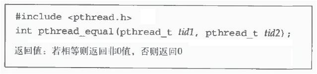

# Linux C Thread
#tech/snippet
进程
系统中程序执行和资源分配的基本单位
每个进程有自己的数据段、代码段和堆栈段
在进行切换时需要有比较复杂的上下文切换

线程
减少处理机的空转时间，支持多处理器以及减少上下文切换开销, 比创建进程小很多
进程内独立的一条运行路线
处理器调度的最小单元，也称为轻量级进程
可以对进程的内存空间和资源进行访问，并与同一进程中的其他线程共享

线程
　　线程相关的执行状态和存储变量放在 **线程控制表** 内
一个进程可以有多个线程，有多个线程控制表及堆栈寄存器，共享一个用户地址空间

多线程同步问题
线程共享进程的资源和地址空间
任何线程对系统资源的操作都会给其他线程带来影响


线程技术发展
Linux 2.2内核
•不存在真正意义上的线程
Linux 2 .4内核
•消除线程个数的限制，允许动态地调整进程数上限
在Linux 内核2.6之前，进程是最主要的处理调度单元，并没支持内核线程机制
Linux 2.6内核
•实现共享地址空间的进程机制, 在1996年第一次获得线程的支持

线程技术发展
为了改善LinuxThread问题，根据新内核机制重新编写线程库, 改善Linux对线程的支持
•由IBM主导的新一代POSIX线程库（Next Generation POSIX Threads，简称为NGPT）
–NGPT项目在2002年启动
–为了避免出现有多个Linux线程标准，在2003年停止该项目
•由Red Hat主导的本地化POSIX线程库 (Native POSIX Thread Library，简称为NTPL)
–最早在Red Hat Linux9中被支持
–现在已经成为GNU C函数库的一部分，同时也成为Linux线程的标准

线程标识
线程ID
•进程ID在整个系统中是唯一的
•线程ID只在它所属的进程环境中有效
函数: pthread_self()


线程标识
pthread_t类型通常用结构来表示
•不能把它作为整数处理
–Linux使用无符号长整数表示
•为了移植，使用函数来比较线程ID
函数: pthread_equal()


 

 

```c
#include <stdio.h>
#include <stdlib.h>
#include <pthread.h>

int main(){
    pthread_t thread_id;

    thread_id=pthread_self(); // 返回调用线程的线程ID
    printf("Thread ID: %lu.\n",thread_id)

    if (pthread_equal(thread_id,pthread_self())) {
//    if (thread_id==0) {
        printf("Equal!\n");
    } else {
        printf("Not equal!\n");
    }
    return 0;
}
```

 

 


线程编程
操作用户空间中的线程

创建线程
•调用该线程函数的入口点
•使用函数pthread_create()，线程创建后，就开始运行相关的线程函数


 

 

```c
#include <stdio.h> 
#include <stdlib.h> 
#include <pthread.h> 
 
void *thrd_func(void *arg); 
pthread_t tid; 
 
int main(){ 
    // 创建线程tid，且线程函数由thrd_func指向，是thrd_func的入口点，即马上执行此线程函数
    if (pthread_create(&tid,NULL,thrd_func,NULL)!=0) {
        printf("Create thread error!\n");
        exit(1);
    }

    printf("TID in pthread_create function: %u.\n",tid);
    printf("Main process: PID: %d,TID: %u.\n",getpid(),pthread_self()); 
    
    sleep(1); //race

    return 0;
}

void *thrd_func(void *arg){
//    printf("I am new thread!\n");
    printf("New process:  PID: %d,TID: %u.\n",getpid(),pthread_self()); //why pthread_self
    printf("New process:  PID: %d,TID: %u.\n",getpid(),tid); //why pthread_self

    pthread_exit(NULL); //退出线程
//    return ((void *)0);
}
```

 

 


退出线程
•在线程函数运行完后，该线程也就退出了
•或使用函数pthread_exit()，这是线程的主动行为
•不能使用exit()


使调用进程终止，所有线程都终止了

等待线程

•由于一个进程中的多个线程是共享数据段的，通常在线程退出之后，退出线程所占用的资源并不会随着线程的终止而得到释放

•pthread_join()函数

类似进程的wait()/waitpid()函数，用于将当前线程挂起来等待线程的结束
是一个线程阻塞的函数，调用它的线程一直等待到被等待的线程结束为止
函数返回时，被等待线程的资源就被收回


 

 

```c
#include <stdio.h>

#include <stdlib.h>

#include <pthread.h>

void * thrd_func1(void * arg);

void * thrd_func2(void * arg);

int main() {
    pthread_t tid1, tid2;
    void * tret; // 创建线程tid1，线程函数
    thrd_func1
    if (pthread_create( & tid1, NULL, thrd_func1, NULL) != 0) {
        pr intf("Create thread 1 error!\n");
        exit(1);
    } // 创建线程tid2,线程函数
    thrd_func2
    if (pthread_create( & tid2, NULL, thrd_func2, NULL) != 0) {
        printf("Create thread 2 error!\n");
        exit(1);
        20
    } // 等待线程tid1结束，线程函数返回值放在tret中
    if (pthread_jo in (tid1, & tret) != 0) {
        printf("Join thread 1 error!\n");
        exit(1);
    }
    printf("Thread 1 exit code: %d.\n", (int * ) tret); // 等待tid2结束，线程函数返回值放在tret中
    if (pthread_join(tid2, & tret) != 0) {
        printf("Join thread 2 error!\n");
        exit(1);
    }
    printf("Thread 2 exit code: %d.\n", (int * ) tret);
    return 0;
}

void * thrd_func1(void * arg) {
    printf("Thread 1 returning!\n"); //    sleep(3);
    return ((void * ) 1); // 自动退出线程
}

void * thrd_func2(void * arg) {
    printf("Thread 2 exiting!\n");
    pthread_e xit((void * ) 2); // 线程主动退出，返回(void *)2
}
```

 

 


取消线程

•在别的线程中要终止另一个线程
•pthread_cancel()函数
•被取消的线程可以设置自己的取消状态
–被取消的线程接收到另一个线程的取消请求之后，是接受还是忽略这个请求
–如果接受，是立刻进行终止操作还是等待某个函数的调用等


 

 

```c
#include <stdio.h>

#include <stdlib.h>

#include <pthread.h>

void * thrd_func1(void * arg);
void * thrd_func2(void * arg);

pthread_t tid1, tid2;

int main() { // 创建线程tid1，线程函数thrd_func1
    if (pthread_create( & tid1, NULL, thrd_func1, NULL) != 0) {
        printf("Create thread 1 error!\n");
        exit(1);
    } // 创建线程tid2，线程函数thrd_func2
    if (pthread_create( & tid2, NULL, thrd_func2, NULL) != 0) {
        printf("Create thread 2 err      or!\n");
        exit(1);
    } // 等待线程tid1退出
    if (pthread_join(tid1, NULL) != 0) {
        printf("Join thread 1 error!\n");
        exit(1);
    } else printf("Thread 1 Joined!\n"); // 等待线程tid2退出
    if (pthread_join(tid2, NULL) != 0) {
        printf("Join thread 2 error!\n");
        exit(1);
    } else printf("Thread 2 Joined!\n");
    return 0;
}

void * thrd_func1(void * arg) { //    pthread_setcancelstate(PTHREAD_CANCEL_DISABLE,NULL);
    pthread_setcancelstate(PTHREAD_CANCEL_ENABLE, NULL); // 设置其他线程可以cancel掉此线程
    while (1) {
        printf("Thread 1 is running!\n");
        sleep(1);
    }
    pthread_exit((void * ) 0);
}

void * thrd_func2(void * arg) {
    printf("Thread 2 is running!\n");
    sleep(5);
    if (pthread_canc el(tid1) == 0) // 线程tid2向线程tid1发送cancel
        printf("Send Cancel cmd to Thread 1.\n");
    pthread_exit((void * ) 0);
}
```

 

 


 

 

```c
#include <stdio.h>
#include <stdlib.h> 
#include <pthread.h> 

#define THREAD_NUM 3 
#define REPEAT_TIMES 5 
#define DELAY 4 

void *thrd_func(void *arg);

int main(){
    pthread_t thread[THREAD_NUM];
    int no;
    void *tret;

    srand((int)time(0)); // 初始化随机函数发生器 

    for(no=0;no<THREAD_NUM;no++){
        if (pthread_create(&thread[no],NULL,thrd_func,(void*)no)!=0) { // 创建THREAD_NUM个线程，传入(void*)no作为thrd_func的参数
            printf("Create thread %d error!\n",no);
            exit(1);
        } else
        printf("Create thread %d success!\n",no);
    }

    for(no=0;no<THREAD_NUM;no++){
        if (pthread_join(thread[no],&tret)!=0){ // 等待thread[no]线程结束，线程函数返回值放在tret中
            printf("Join thread %d error!\n",no);
            exit(1);
        }else
        printf("Join thread %d success!\n",no);
    }              
    return 0;
} 

void *thrd_func(void *arg){     
    int thrd_num=(void*)arg;
    int delay_time=0;
    int count=0; 

    printf("Thread %d is starting.\n",thrd_num);
    for(count=0;count<REPEAT_TIMES;count++) {
        delay_time=(int)(DELAY*(rand()/(double)RAND_MAX))+1;
        sleep(delay_time);
        printf("\tThread %d:job %d delay =%d.\n",thrd_num,count,delay_time);
    } 
    printf("Thread %d is exiting.\n",thrd_num);
    pthread_exit(NULL);
}
```

 

 


**线程同步与互斥**
线程共享进程的资源和地址空间，对这些资源进行操作时，必须考虑线程间同步与互斥问题
三种线程同步机制
•互斥锁
•信号量
•条件变量
互斥锁更适合同时可用的资源是惟一的情况
信号量更适合同时可用的资源为多个的情况


互斥锁
用简单的加锁方法控制对共享资源的原子操作
只有两种状态: 上锁、解锁
可把互斥锁看作某种意义上的全局变量
在同一时刻只能有一个线程掌握某个互斥锁，拥有上锁状态的线程能够对共享资源进行操作
若其他线程希望上锁一个已经被上锁的互斥锁,则该线程就会挂起，直到上锁的线程释放掉互斥锁为止
互斥锁保证让每个线程对共享资源按顺序进行原子操作

互斥锁分类
区别在于其他未占有互斥锁的线程在希望得到互斥锁时是否需要阻塞等待
快速互斥锁
•调用线程会阻塞直至拥有互斥锁的线程解锁为止
•默认为快速互斥锁
检错互斥锁
•为快速互斥锁的非阻塞版本，它会立即返回并返回一个错误信息

互斥锁主要包括下面的基本函数：
互斥锁初始化：pthread_mutex_init()
互斥锁上锁：pthread_mutex_lock()
互斥锁判断上锁：pthread_mutex_trylock()
互斥锁解锁：pthread_mutex_unlock()
消除互斥锁：pthread_mutex_destroy()


View Code


和上一版本的程序差异在于有没有锁，有锁的情况下，必须等"thread x is exiting."之后其他线程才能继续。

信号量
操作系统中所用到的PV原子操作，广泛用于进程或线程间的同步与互斥
•本质上是一个非负的整数计数器，被用来控制对公共资源的访问
PV原子操作：对整数计数器信号量sem的操作
•一次P操作使sem减一，而一次V操作使sem加一
•进程（或线程）根据信号量的值来判断是否对公共资源具有访问权限
–当信号量sem的值大于等于零时，该进程（或线程）具有公共资源的访问权限
–当信号量sem的值小于零时，该进程（或线程）就将阻塞直到信号量sem的值大于等于0为止

PV操作主要用于线程间的同步和互斥
互斥，几个线程只设置一个信号量sem
同步，会设置多个信号量，安排不同初值来实现它们之间的顺序执行


信号量函数
sem_init() 创建一个信号量，并初始化它
sem_wait()和sem_trywait(): P操作，在信号量大于零时将信号量的值减一
•区别: 若信号量小于零时，sem_wait()将会阻塞线程,sem_trywait()则会立即返回
sem_post(): V操作，将信号量的值加一同时发出信号来唤醒等待的线程
sem_getvalue(): 得到信号量的值
sem_destroy(): 删除信号量


eg. 同步各线程，执行顺序为逆序。


View Code


http://pic002.cnblogs.com/images/2012/350751/2012041520535874.jpg
