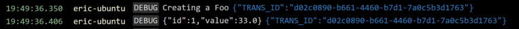
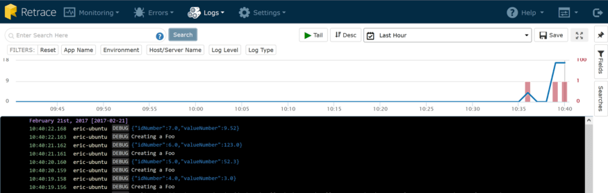
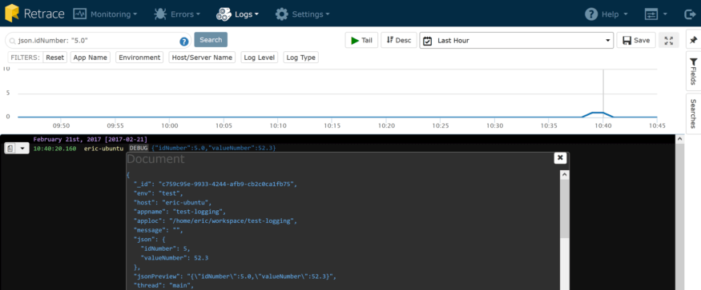
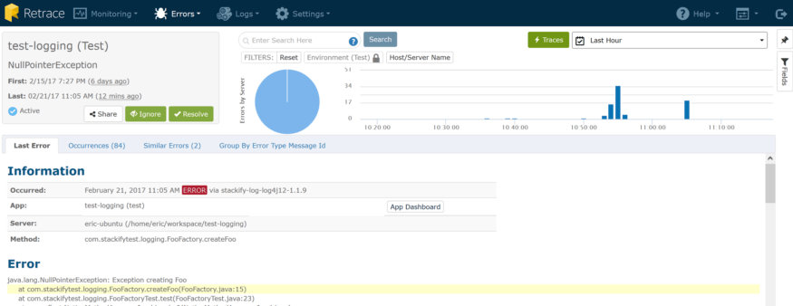
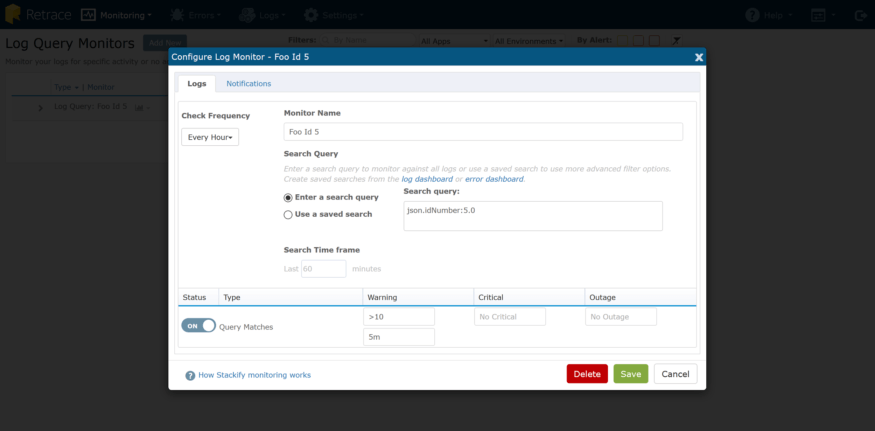
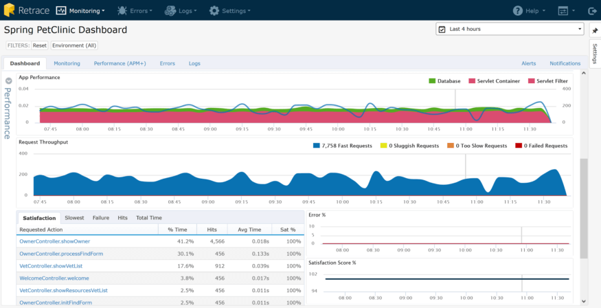

# Java Log Best Practices
What do I mean? There are lots of Java logging frameworks and libraries out there, and most developers use one or more of them every day. Two of the most common examples for Java developers are log4j and logback. They are simple and easy to use and work great for developers. Basic java log files are just not enough, though, but we have some Java best practices and tips to help you make the most of them!

Have you ever had to work with your log files once your application left development? If so, you quickly run into a few pain points.

* There’s a lot more data.
* You have to get access to the data.
* It’s **spread across multiple servers.**
* A specific operation may be spread across applications – so even more logs to dig through.
* It’s flat and hard to query; even if you do put it in SQL, you are going to have to do full-text indexing to make it usable.
* It’s hard to read; messages are scrambled like spaghetti.
* You generally don’t have any context of the user, etc.
* You probably lack some details that would be helpful. (You mean “log.Info(‘In the method’)” isn’t helpful???)
* You will be managing log file rotation and retention.
Additionally, you have all this rich data about your app that is being generated and you simply aren’t _proactively putting it to work_.

## *It’s Time to Get Serious About Logging*

Once you’re working on an application that is not running on your desktop,
logging messages (including exceptions) are usually your only lifeline to
_quickly_ discovering why something in your app isn’t working correctly. Sure,
[APM tools](https://stackify.com/application-performance-management-tools/) can
alert you to memory leaks and performance bottlenecks,
but generally lack enough detail to help you solve a specific problem, i.e. why
can’t _this_ user log in, or why isn’t _this_ record processing?

At Stackify, we’ve built a “culture of logging” which set out to accomplish these goals:

1. **Log all the things.** Log as much as we possibly can, to always have relevant, contextual logs that don’t add overhead.
2. **Work smarter, not harder.** Consolidate and [aggregate all of our logging](https://stackify.com/log-management/) to a central location, available to all devs, and _easy to distil_. Also, to find new ways for our logging and exception data to help us _proactively_ improve our product.
  
In this post, we’ll explore these best practices, and share what we’ve done to address it, much of which has become a part of Stackify’s [log management](https://stackify.com/log-management/) product. Also, if you haven’t used [Prefix to view your logs](https://stackify.com/best-log-viewer-prefix/), be sure to check it out!

## *Start*   *Logging All the Things!*

I’ve worked in a lot of shops where log messages looked like this:


I’ll give the developer credit; at least they are using a try/catch and handling the exception. The exception will likely have a stack trace so I know roughly where it came from, but **no other context** is logged.

Sometimes, they even do some more proactive logging, like this:


But generally, statements like that don’t go a long way towards letting you know what’s really happening in your app. If you’re tasked with troubleshooting an error in production, and/or it is happening for just one (or a subset) of the application users, this doesn’t leave you with a lot to go on, especially when considering your log statement could be a needle in a haystack in an app with lots of use.

As I mentioned earlier, logging is often one of the few lifelines you have in production environments where you can’t physically attach and debug. You want to log as much relevant, contextual data as you can. Here are our guiding principles on doing that.

## *Walk the Code*

Let’s pretend that you have a process that you want to add logging around so that you can look at what happened. You _could_ just put a try / catch around the entire thing and handle the exceptions (which you should) but it doesn’t tell you much about **what was passed _into_ the request**. Take a look at the following, oversimplified example.

```java
public class Foo {

    private int id;
       
    private double value;
    
    public Foo(int id, double value) {
   	 this.id = id;
   	 this.value = value;
    }
    
    public int getId() {
   	 return id;
    }

    public double getValue() {
   	 return value;
    }
    
}
```

Take the following factory method, which creates a
Foo. Note how I’ve opened the door for error – the method takes a Double as an
input parameter. I call doubleValue() but don’t check for null. This could
cause an exception.

```java
public class FooFactory {

    public static Foo createFoo(int id, Double value) {
   	 return new Foo(id, value.doubleValue());
    }
    
}
```

This is a simple scenario, but it serves the purpose well. Assuming this is a really critical aspect of my Java app (can’t have any failed Foos!) let’s add some basic logging so we know what’s going on.

```java
public class FooFactory {

    private static Logger LOGGER = LoggerFactory.getLogger(FooFactory.class);
    
    public static Foo createFoo(int id, Double value) {
   	 
   	 LOGGER.debug("Creating a Foo");
   	 
   	 try {
   		 Foo foo = new Foo(id, value.doubleValue());
   		 
   		 LOGGER.debug("{}", foo);
   		 
   		 return foo;
   		 
   	 } catch (Exception e) {
   		 LOGGER.error(e.getMessage(), e);
   	 }
   	 
   	 return null;
    }
    
}
```

Now, let’s create two foos; one that is valid and one that is not:

```java
FooFactory.createFoo(1, Double.valueOf(33.0));
    FooFactory.createFoo(2, null);
```

And now we can see some logging, and it looks like this:

```
2017-02-15 17:01:04,842 [main] DEBUG com.stackifytest.logging.FooFactory: Creating a Foo
2017-02-15 17:01:04,848 [main] DEBUG com.stackifytest.logging.FooFactory: com.stackifytest.logging.Foo@5d22bbb7
2017-02-15 17:01:04,849 [main] DEBUG com.stackifytest.logging.FooFactory: Creating a Foo
2017-02-15 17:01:04,851 [main] ERROR com.stackifytest.logging.FooFactory:
java.lang.NullPointerException
    at com.stackifytest.logging.FooFactory.createFoo(FooFactory.java:15)
    at com.stackifytest.logging.FooFactoryTest.test(FooFactoryTest.java:11)
```

Now we have some logging – we know when Foo objects are created, and when they fail to create in createFoo(). But we are missing some context that would help. The default toString() implementation doesn’t build any data about the members of the object. We have some options here, but let’s have the IDE generate an implementation for us.

```java
@Override
    public String toString() {
   	 return "Foo [id=" + id + ", value=" + value + "]";
    }
```

Run our test again:

```
2017-02-15 17:13:06,032 [main] DEBUG com.stackifytest.logging.FooFactory: Creating a Foo
2017-02-15 17:13:06,041 [main] DEBUG com.stackifytest.logging.FooFactory: Foo [id=1, value=33.0]
2017-02-15 17:13:06,041 [main] DEBUG com.stackifytest.logging.FooFactory: Creating a Foo
2017-02-15 17:13:06,043 [main] ERROR com.stackifytest.logging.FooFactory:
java.lang.NullPointerException
    at com.stackifytest.logging.FooFactory.createFoo(FooFactory.java:15)
    at com.stackifytest.logging.FooFactoryTest.test(FooFactoryTest.java:11)
```

**Much better!** Now we can see the object that was logged as “[id=, value=]”. Another option you have for toString is to use Javas’ reflection capabilities. The main benefit here is that you don’t have to modify the toString method when you add or remove members. Here is an example using Google’s Gson library. Now, let’s look at the output:

```
2017-02-15 17:22:55,584 [main] DEBUG com.stackifytest.logging.FooFactory: Creating a Foo
2017-02-15 17:22:55,751 [main] DEBUG com.stackifytest.logging.FooFactory: {"id":1,"value":33.0}
2017-02-15 17:22:55,754 [main] DEBUG com.stackifytest.logging.FooFactory: Creating a Foo
2017-02-15 17:22:55,760 [main] ERROR com.stackifytest.logging.FooFactory:
java.lang.NullPointerException
    at com.stackifytest.logging.FooFactory.createFoo(FooFactory.java:15)
    at com.stackifytest.logging.FooFactoryTest.test(FooFactoryTest.java:11)
```

When you log objects as JSON and use Stackify’s Retrace tool, you can get some nice details like this:


Retrace Logging Dashboard JSON Viewer

## *Logging More Details with Diagnostic Contexts*

And this brings us to one last point on logging more details: diagnostic context logging. When it comes to debugging a production issue, you might have the “Creating a Foo” message thousands of times in your logs, but with no clue who the logged in user was that created it. Know who the user was is the sort of context that is priceless in being able to quickly resolve an issue. Think about what other detail might be useful – for example, HttpWebRequest details. But who wants to have to remember to log it every time? Diagnostic context logging to the rescue, specifically the mapped diagnostic context. Read more about SLF4J’s MDC here: [https://logback.qos.ch/manual/mdc.html](https://logback.qos.ch/manual/mdc.html).

The easiest way to add context items to your logging is usually a servlet filter. For this example, let’s create a servlet filter that generates a transaction id and attaches it to the MDC.

```java
public class LogContextFilter implements Filter {

    public void init(FilterConfig config) {
    }
    
    public void destroy() {
    }

    public void doFilter(ServletRequest request, ServletResponse response, FilterChain chain) throws ServletException, IOException {
   	 
   	 String transactionId = UUID.randomUUID().toString();
   	 
   	 MDC.put("TRANS_ID", transactionId);
   	 
   	 try {
   		 chain.doFilter(request, response);
   	 }
   	 finally {
   		 MDC.clear();
   	 }
    }

}
```

Now, we can see some log statements like this:


More context. We can now trace all log statements from a single request.

This brings us to the next topic, which is **Work Harder, Not Smarter.** But before that, I’m going to address a question I’m sure to hear a lot of in the comments: “But if I log _everything_ won’t that create overhead, unnecessary chatter, and huge log files?” My answer comes in a couple of parts: first, use the logging verbosity levels. you can _LOGGER.debug()_ **everything you think you’ll need**, and then set your config for production appropriately, i.e. Warning and above only. When you do need the debug info, it’s only changing a config file and not redeploying code. Second, if you’re logging in an _async, non-blocking way_, then overhead should be low. Last, if you’re worried about space and log file rotation, there are smarter ways to do it, and we’ll talk about that in the next section.

## *Work Smarter, Not Harder*

Now that we’re logging _everything_, and it’s providing more contextual data, we’re going to look at the next part of the equation. As I’ve mentioned, and demonstrated, just dumping all of this out to flat files still doesn’t help you out a lot in a large, complex application and environment. Factor in thousands of requests, files spanning multiple days, weeks, or longer, and across multiple servers, you have to consider how you are going to quickly find the data that you need.

What we all really need is a solution that provides:

* Aggregates all Log & Exception data to one place
* Makes it available, instantly, to everyone on your team
* Presents a timeline of logging throughout your entire stack/infrastructure
* Is highly indexed and searchable by being in a  [structured format](https://stackify.com/what-is-structured-logging-and-why-developers-need-it/)
This is the part where I tell you about Stackify Retrace. As we
sought to improve our own abilities to quickly and efficiently work with our
log data, we decided to make it a core part of our product (yes, we use
Stackify to monitor Stackify) and share with our customers, since we believe
it’s an issue central to application troubleshooting.

First, we realize that lots of developers already have logging in place, and aren’t going to want to take a lot of time to rip that code out and put new code in. That’s why we’ve created logging appenders for the most common Java logging frameworks.

Continuing with log4j as a sample, the setup is easy. Just add the Stackify appender to your project’s maven pom file.

```
<dependency>
   <groupId>com.stackify</groupId>
   <artifactId>stackify-log-log4j12</artifactId>
   <version>1.1.9</version>
   <scope>runtime</scope>
</dependency>
```

Also, add in some configuration for the Stackify appender to your logging.properties file.

```
log4j.rootLogger=DEBUG, CONSOLE, STACKIFY

log4j.appender.CONSOLE=org.apache.log4j.ConsoleAppender

log4j.appender.CONSOLE.layout=org.apache.log4j.PatternLayout
log4j.appender.CONSOLE.layout.ConversionPattern=%d [%t] %-5p %c: %m%n

log4j.appender.STACKIFY=com.stackify.log.log4j12.StackifyLogAppender
log4j.appender.STACKIFY.apiKey=[HIDDEN]
log4j.appender.STACKIFY.application=test-logging
log4j.appender.STACKIFY.environment=test
```

As you can see, if you’re already using a different appender, you can keep it in place and put them side-by-side. Now that you’ve got your logs streaming to Stackify we can take a look at the logging dashboard. (By the way, if our monitoring agent is installed, you can also send Syslog entries to Stackify as well!)


This dashboard shows a consolidated stream of log data, coming from all your servers and apps, presented in a timeline. From here, you can quickly

* View logs based on a range of time
* Filter for specific servers, apps, or environments
Plus there are a couple of really great usability things built in. One of the first things you’ll notice is that chart at the top. It’s a great way to quickly “triage” your application. The blue line indicates the rate of log messages, and the red bars indicate # of exceptions being logged.

It’s clear that a few minutes ago, my web app started having a lot more consistent activity but more importantly, we started getting more exceptions about the same time. Exceptions don’t come without overhead for your CPU and memory, and they also can have a direct impact on user satisfaction, which can cost real money.

By zooming in on the chart to this time period, I can quickly filter my log detail down to that time range and take a look at the logs for that period of time.


## *Searching Your Logs*

Do you see that blue text below that looks like a JSON object?


Well, it _is_ a JSON object. That’s the result of logging objects, and adding context properties earlier. It looks a lot nicer than plain text in a flat file, doesn’t it? Well, it gets even more awesome. See the search box at the top of the page? I can put in any search string that I can think of, and it will **query all my logs as if it were a flat file**. As we discussed earlier, however, this isn’t _great_ because you could end up with a lot more matches than you want. Suppose that I want to search for all objects with an id of 5. Fortunately, our log aggregator is smart enough to help in this situation. That’s because when we find serialized objects in logs, we index each and every field we find. That makes it easy to perform a search like this:

```
json.idNumber:5.0
```

That search yields the following results:


Want to know what else you can search by? Just click on the document icon when you hover over a log record, and you’ll see all the fields that Stackify indexes. Being able to get more value out of your logs and search by all the fields is called [structured logging](https://stackify.com/what-is-structured-logging-and-why-developers-need-it/).


## Exploring Java  *Exception Details*

You may have also noticed this little red bug icon (

) next to exception messages. That’s because we treat exceptions differently by automatically showing more context. Click on it and we present a deeper view of that exception.


Our libraries not only grab the full stack trace, but all of the web request details, including headers, query strings, and server variables, when available. In this modal, there is a “Logs” tab which gives you a pre-filtered view of the logging from the app that threw the error, on the server where it occurred, for a narrow time window before and after the exception, to give more context around the exception. Curious about how common or frequent this error occurs, or want to see details on other occurrences? Click the “View All Occurrences” button and voila!


I can quickly see this error has occurred 60 times over the last hour. Errors and logs are closely related, and in an app where a tremendous amount of logging can occur, exceptions could sometimes get a bit lost in the noise. That’s why we’ve built an [Errors Dashboard](https://stackify.com/error-monitoring/) as well, to give you this same consolidated view but limited to exceptions.


Here I can see a couple of great pieces of data:

* I’ve had an uptick in my rate of exceptions over the past few minutes.
* The majority of my errors are coming from my “test” environment – to the tune of about 84 per hour.
* I have a couple of new errors that have just started occurring (as indicated by the red triangles).
Have you ever put a new release of your app out to production and wondered what QA missed? (Not that I’m saying QA would ever miss a bug……) Error Dashboard to the rescue. You can watch real time and see a trend – lots of red triangles, lots of new bugs. Big spike in the graph? Perhaps you have an increase in usage, so a previously known error is being hit more; perhaps some buggy code (like a leaking SQL connection pool) went out and is causing a higher rate of SQL timeout errors than normal.

It’s not hard to imagine a lot of different scenarios for which this could provide early warning and detection. Hmm. Early warning and detection. That brings up another great topic.

## Monitor

Wouldn’t it be nice to be alerted when

* An error rate for a specific app or environment suddenly increases?
* An error that was specifically resolved starts happening again?
* A certain action that you log does not happen enough, too often, etc?
Stackify can do all of that. Let’s take a look at each.

## Error Rates

When we looked at the error dashboard, I noted that my ‘test’ environment is getting a high number of errors per hour. From the Error dashboard, click on “Error Rates” and then select which app/environment you wish to configure alerts for:


I can configure monitors for “Errors/Minute” and “Total Errors Last 60 minutes” and then choose the “Notifications” tab to specify who should be alerted, and how. Subsequently, if using Stackify Monitoring, I can configure all of my other alerting here as well: App running state, memory usage, performance counters, custom metrics, ping checks, and more.

### *Resolved Errors & New Errors*

Earlier on, I introduced a new error by not checking for null values when creating Foo objects. I’ve since fixed that and confirmed it by looking at the details for that particular error. As you can see, the last time it happened was 12 minutes ago:


It was a silly mistake, but one that is easy to make. I’m going to mark this one as “resolved” which lets me do something really cool: get an alert if it comes back. The Notifications menu will let me check my configuration, and by default, I’m set to receive both new and regressed error notifications for all my apps and environments.


Now, if the same error occurs again in the future, I’m going to get an email about the regression and it shows up on the dashboard as such. This is a great little bit of automation to help out when you “think” you’ve solved the issue and want to make sure.

### *Log Monitors*

Some things aren’t very straightforward to monitor. Perhaps you have a critical process that runs asynchronously and the only record of its success (or failure) is logging statements. Earlier in this post, I showed the ability to run deep queries against your [structured log data](https://stackify.com/what-is-structured-logging-and-why-developers-need-it/), and any of those queries can be saved and monitored. I’ve got a very simple scenario here: my query is executed every minute, and we can monitor how many matching records we have.


It’s just a great simple way to check system health if a log file is your only indication.

## *Java Logging Best Practices*

All of this error and log data can be invaluable, especially when you take a step back and look at a slightly larger picture. Below is the Application Dashboard for a Java web app that contains all of the monitoring:


As you can see, you get some great contextual data at a glance that errors and logs contribute to: Satisfaction and HTTP Error Rate. You can see that user satisfaction is high and the HTTP error rate is low. You can quickly start drilling down to see which pages might not be performing well, and what errors are occurring:


There was a lot to cover in this post, and I feel like I barely scratched the surface. If you dig a little deeper or even get your hands on it, you can! I hope that these Java logging best practices will help you write better logs and save time troubleshooting.

All of our Java logging appenders are available on [GitHub](https://github.com/stackify) and you can  [sign up for a free trial](https://stackify.com/sign-up/) to get started with Stackify today!

[Java Best Practices for Smarter Application Logging & Exception Handling](https://stackify.com/java-logging-best-practices/)
